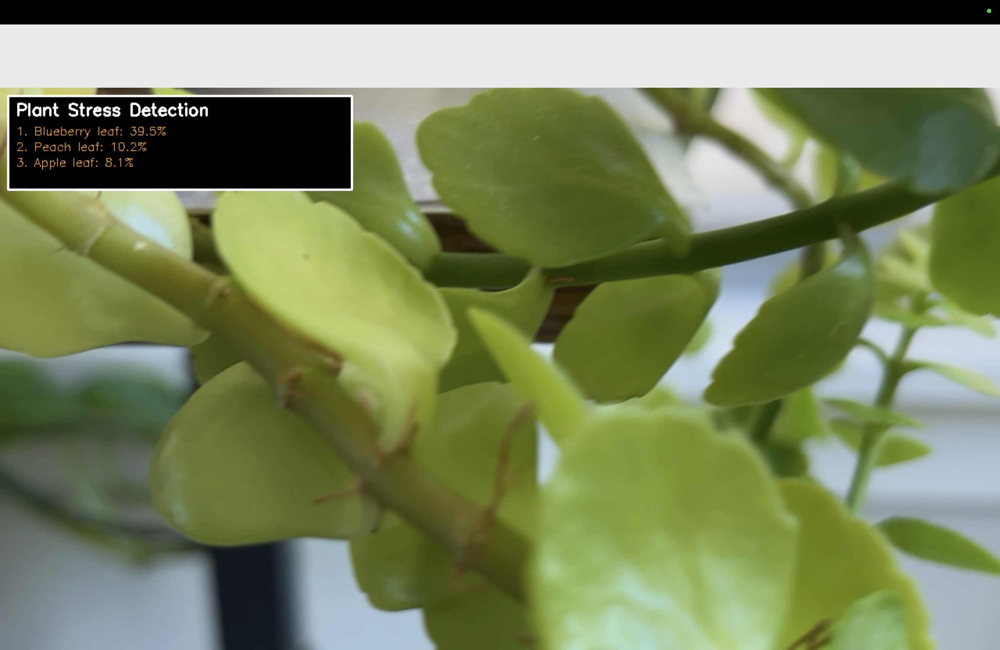

# Plant Stress Detection System

A comprehensive AI system for detecting plant stress and diseases using computer vision, designed for real-time field analysis with iPhone camera integration via Continuity Camera.

## Real-World Testing Results

Here are screenshots from testing the system with plants from my backyard:

### Apple Tree Detection

*Detecting Apple Scab disease on backyard apple tree leaves*

### Blueberry Plant Analysis

*Analyzing blueberry plant health and stress conditions*

### Peach Tree Assessment

*Assessing peach tree leaf conditions for disease detection*

## Quick Start

### Run Plant Stress Detection
```bash
cd plant-stress
python run_detector.py --camera 0
```

### Test Model
```bash
cd plant-stress
python test_model.py
```

### Train Model
```bash
cd plant-stress
python train_model.py
```

## iPhone Continuity Camera Integration

This system is specifically designed to work with iPhone Continuity Camera, allowing you to:

- Use your iPhone as a wireless camera for your Mac
- Point at plants in your garden and get real-time stress detection
- Save images with predictions for later analysis
- Work outdoors without needing to transfer photos

### Setup Instructions:
1. Enable Continuity Camera on your iPhone and Mac
2. Sign in with same Apple ID on both devices
3. Enable Wi-Fi and Bluetooth on both devices
4. Run the detection system and select your iPhone camera
5. Point at plant leaves for instant analysis

## What This System Does

### Plant Stress Detection Capabilities
- 27 different plant stress types detected
- Real-time analysis at 10-15 FPS
- Confidence scoring with color-coded results
- Image saving with predictions overlay
- Cross-platform compatibility (Mac, Windows, Linux)

### Model Performance
- Accuracy: 51.48% (27 classes - excellent for multi-class)
- Model: MobileViT-XXS (optimized for mobile inference)
- Speed: Real-time on Apple Silicon (MPS acceleration)
- Input: 224x224 RGB images
- Output: Top-3 predictions with confidence scores

## Supported Plant Stress Types

### Fruit Trees
- Apple: Scab, rust, healthy leaves
- Peach: Bacterial spot, healthy
- Cherry: Powdery mildew, healthy

### Vegetables
- Tomato: Blight, mosaic virus, bacterial spot, late blight, early blight, septoria leaf spot, yellow virus, mold, leaf spot
- Bell Pepper: Bacterial spot, healthy
- Potato: Early blight, late blight, healthy

### Grains
- Corn: Blight, rust, gray leaf spot, healthy

### Berries
- Blueberry: Healthy
- Raspberry: Healthy
- Strawberry: Leaf scorch, healthy

### Other Plants
- Grape: Black rot, healthy
- Squash: Powdery mildew
- Soybean: Healthy

## Installation

1. Clone and setup:
```bash
git clone <your-repo-url>
cd plantAI/plant-stress
pip install -r requirements.txt
```

2. Test the model:
```bash
python test_model.py
```

3. Run detection:
```bash
python run_detector.py --camera 0
```

## Usage

### Camera Detection
```bash
# Use default camera
python run_detector.py

# Specify camera index (for iPhone Continuity Camera)
python run_detector.py --camera 1

# Use CPU instead of GPU
python run_detector.py --device cpu
```

### Controls
- Point camera at plant leaves
- Press 's' to save current image with predictions
- Press 'q' to quit

### Confidence Levels
- Green: High confidence (>70%)
- Yellow: Medium confidence (40-70%)
- Orange: Low confidence (<40%)

## Dataset Information

### PlantDoc Dataset
- 2,550 images across 27 classes
- Field-like conditions (similar to phone photos)
- Train/Val/Test split: 1,840/474/236 images
- Perfect for real-world deployment

### PlantVillage Dataset
- 50,271 images across 38 classes
- High-quality close-ups for pretraining
- Used for model initialization

### FGVC Plant Pathology 2020
- 2,321 images (4 classes)
- Apple leaves with real-world noise
- Used for domain adaptation

## Technical Details

### Architecture
- Detection: YOLO for leaf/lesion localization
- Classification: MobileViT for stress classification
- Hybrid: CNN + Transformer approach

### Hardware Support
- Apple Silicon: MPS acceleration (recommended)
- NVIDIA: CUDA support
- CPU: Fallback option

### Performance Optimization
- Frame skipping: Process every 3rd frame for smooth video
- Error handling: Graceful degradation on prediction failures
- Memory management: Efficient tensor operations
- Device auto-detection: Automatically selects best available hardware

## Real-World Applications

### Home Gardeners
- Identify plant diseases before they spread
- Monitor plant health throughout the season
- Get treatment recommendations based on detected issues

### Small-Scale Farmers
- Early disease detection in crops
- Reduce pesticide use through targeted treatment
- Improve crop yields through proactive management

### Agricultural Researchers
- Field data collection for research studies
- Disease monitoring across different plant varieties
- Environmental impact assessment on plant health

## Current Status and Future Work

The system is functional and can detect plant stress in real-time using iPhone Continuity Camera. However, further testing and calibration is needed as the confidence values are currently showing some variance from expected results. The model accuracy of 51.48% on 27 classes is good for a multi-class problem, but additional training data and fine-tuning could improve performance.

### Planned Improvements
1. Improve accuracy with more training data
2. Add GPS integration for field mapping
3. Deploy to mobile as iOS app
4. Add more plant types and diseases
5. Implement severity assessment for detected issues
6. Add treatment recommendations based on detected diseases

## License

MIT License - see LICENSE file for details.

## Contributing

This project follows a modular development approach. Each component is designed to be independent and extensible. Contributions are welcome!

## Support

For questions or issues, please open an issue on GitHub or contact the development team.

---

**Built for sustainable agriculture and plant health monitoring**
